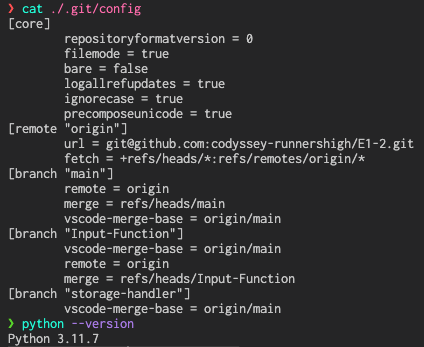
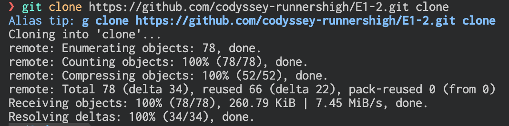
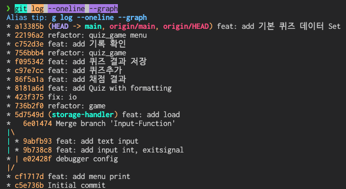
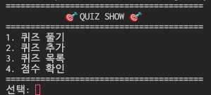
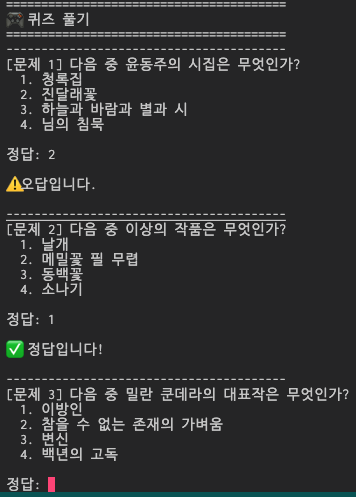
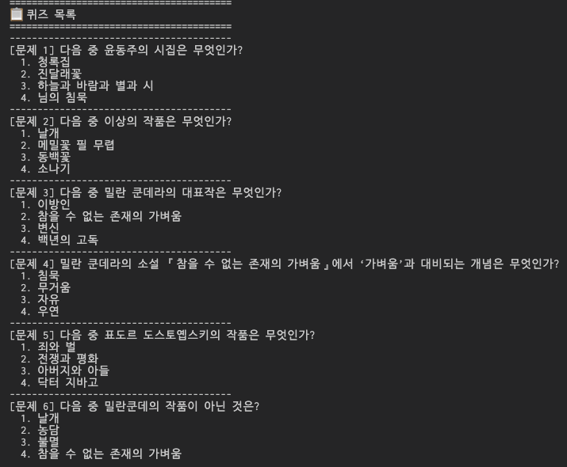
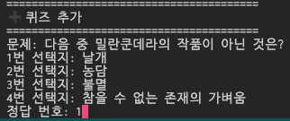
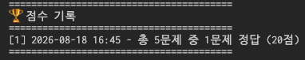

# 🎯 QUIZ SHOW

## 프로젝트 개요

현대문학과 작가에 관한 간단한 퀴즈게임입니다.
퀴즈를 풀고, 새 퀴즈를 추가하고, 점수 기록을 확인할 수 있습니다.
데이터는 JSON 파일(`state.json`)에 저장되며, 파일이 없거나 손상된 경우 내장된 기본 퀴즈 데이터로 자동 복구됩니다.

## 퀴즈 주제와 선정 이유

**주제: 문학 작품과 작가**

윤동주, 이상, 밀란 쿤데라, 도스토옙스키 등 한국·세계 문학을 다루는 퀴즈로 구성되어 있습니다.
문학은 시대를 초월하여 공감을 받을 수 있는 주제이며, 작품과 작가를 연결하는 형태의 문제는 4지선다 퀴즈에 적합하기 때문에 선정하였습니다.

## 실행 방법

```bash
python3 quiz_game.py
```

실행 후 메뉴에서 번호를 입력하여 기능을 선택합니다.
종료하려면 `Ctrl+C`를 누릅니다.

## 기능 목록

| 번호 | 메뉴      | 설명                                                         |
| ---- | --------- | ------------------------------------------------------------ |
| 1    | 퀴즈 풀기 | 전체 퀴즈를 순서대로 풀고 결과를 확인·저장합니다.            |
| 2    | 퀴즈 추가 | 문제, 4개 선택지, 정답 번호를 입력하여 새 퀴즈를 추가합니다. |
| 3    | 퀴즈 목록 | 현재 저장된 모든 퀴즈 목록을 확인합니다.                     |
| 4    | 점수 확인 | 상위 5개 점수 기록을 확인합니다.                             |
| 5    | 종료      | 게임을 종료합니다.                                           |

- 데이터 파일이 없거나 손상된 경우 기존 파일을 `.bak`으로 백업한 후 기본 퀴즈 데이터로 자동 복구합니다.

## 파일 구조

```
E1-2/
├── quiz_game.py        # 메인 게임 로직 (QuizGame 클래스, 기본 퀴즈 데이터)
├── quiz.py             # Quiz 데이터 모델
├── io_controller.py    # 입출력 제어 (입력 검증, 출력 포맷)
├── storage_handler.py  # JSON 파일 저장/로드/검증
├── state.json          # 퀴즈 및 점수 데이터 (런타임 생성)
└── README.md           # 프로젝트 설명
```

## 데이터 파일 설명

### `state.json`

- **경로**: 프로젝트 루트 (`./state.json`)
- **역할**: 퀴즈 문제와 점수 기록을 영구 저장하는 데이터 파일입니다. 퀴즈 추가·풀이 시 자동으로 갱신됩니다.
- **스키마**:

```json
{
  "quizzes": [
    {
      "QUESTION": "문제 텍스트",
      "CHOICES": {
        "1": "선택지 1",
        "2": "선택지 2",
        "3": "선택지 3",
        "4": "선택지 4"
      },
      "CORRECT_ANSWER": 1
    }
  ],
  "records": [
    {
      "QUESTION_COUNT": 5,
      "CORRECT_COUNT": 3,
      "SCORE": 60,
      "DATE": "2026-08-18 16:45"
    }
  ]
}
```

| 키                         | 타입   | 설명                             |
| -------------------------- | ------ | -------------------------------- |
| `quizzes`                  | `list` | 퀴즈 목록                        |
| `quizzes[].QUESTION`       | `str`  | 문제 텍스트                      |
| `quizzes[].CHOICES`        | `dict` | `"1"`~`"4"` 키에 대응하는 선택지 |
| `quizzes[].CORRECT_ANSWER` | `int`  | 정답 번호 (1~4)                  |
| `records`                  | `list` | 점수 기록 목록                   |
| `records[].QUESTION_COUNT` | `int`  | 총 문제 수                       |
| `records[].CORRECT_COUNT`  | `int`  | 정답 수                          |
| `records[].SCORE`          | `int`  | 점수 (백분율, 소수점 반올림)     |
| `records[].DATE`           | `str`  | 저장 시각 (`YYYY-MM-DD HH:MM`)   |


## 스크린샷

### 1. 개발 및 실행 환경
- **환경 설정 (`env.png`)**
  
- **저장소 복제 (`clone.png`)**
  
- **Git 커밋 로그 (`gitlog.png`)**
  

### 2. 게임 메뉴 및 기능
- **메인 메뉴 (`menu.png`)**
  
- **퀴즈 풀기 (`play.png`)**
  
- **퀴즈 목록 (`quiz_list.png`)**
  
- **퀴즈 추가 (`add_quiz.png`)**
  
- **점수 확인 (`socre.png`)**
  